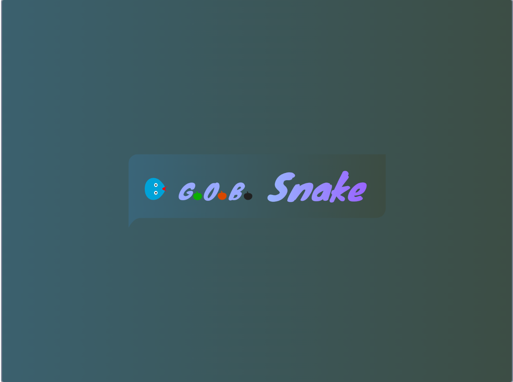
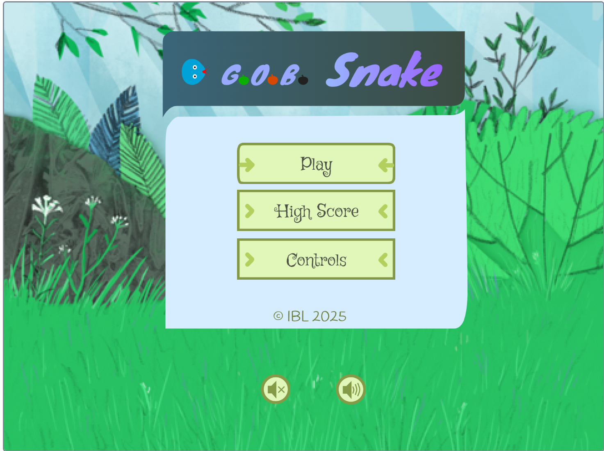
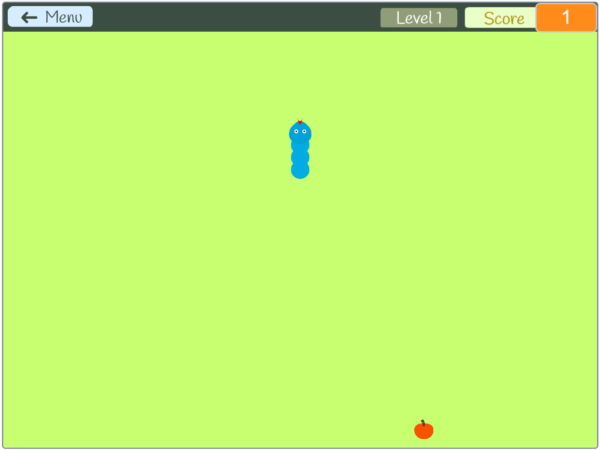
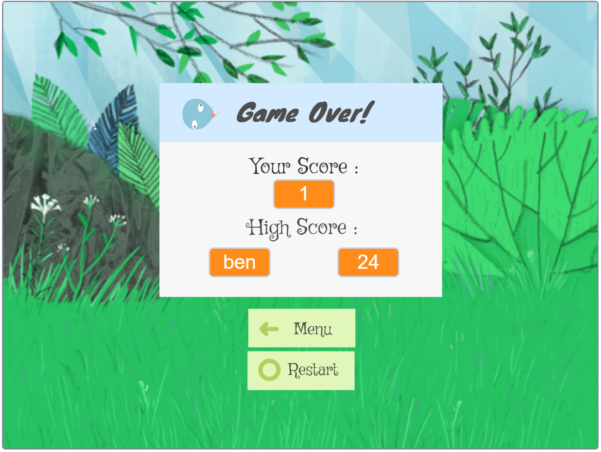

# 🐍 GOB Snake Game

[](https://scratch.mit.edu/projects/1140783356) [](LICENSE) [](https://github.com/ben3210/GOB-Snake-Game/stargazers)

**GOB Snake Game** is a dynamic arcade experience built in Scratch. While it stays true to the classic "Snake" formula, it introduces a strategic scoring system where different fruits affect both your score and your snake's length, creating a fun and challenging **risk vs. reward** gameplay loop.

## 📸 Screenshots

| Intro Animation | Main Menu | Game | Game Over |
|-----------------|-----------|------|-----------|
|  |  |  |  |

## 🚀 Key Features

### 🍏 Dynamic Fruit System
| Fruit | Effect | Notes |
|-------|--------|-------|
| 🟢 Green Fruit | +5 points | Large growth |
| 🟠 Orange Fruit | +1 point | Standard growth |
| ⚫ Black Fruit | -5 points | Shrinks snake — perfect for tight spots! |

### 🌀 Other Features
* **Cloning Engine:** Smooth, variable-length tail using Scratch cloning.
* **Responsive Controls:** Instant feedback with arrow keys.
* **Strategic Depth:** Balance your length to avoid collisions as the game speeds up.

## 🕹️ How to Play

1. **Download:** Clone this repository or download `Ben's Snake Game GOB.sb3`.
2. **Open:** Go to the [Scratch Editor](https://scratch.mit.edu/projects/editor/).
3. **Import:** Click `File → Load from your computer` and select the project file.
4. **Controls:**
   * ⬆️ Up Arrow: Move Up
   * ⬇️ Down Arrow: Move Down
   * ⬅️ Left Arrow: Move Left
   * ➡️ Right Arrow: Move Right

💻 **Live Demo:** [Play on Scratch](https://scratch.mit.edu/projects/1140783356)

## 🛠️ Concepts Demonstrated

* **Variable Management:** Score and snake length tracking.
* **Cloning & Memory:** Managing clone lifespans to simulate smooth movement.
* **Coordinate Geometry:** Random fruit spawning using X/Y grids.
* **Conditional Logic:** Collision detection for boundaries and self-intersection.

## 📂 Project Structure

```

├── Ben's Snake Game GOB.sb3
├── README.md
└── screenshots/
├── intro.png
├── menu.png
├── game.png
└── game_over.png

```

## 👤 Author

**Benjamin Irabisohoje**  
[GitHub Profile](https://github.com/ben3210)

## 🌟 Enjoy Playing & Contributing!

Feel free to ⭐ the repository if you like it or fork it to create your own twist on the classic snake game.